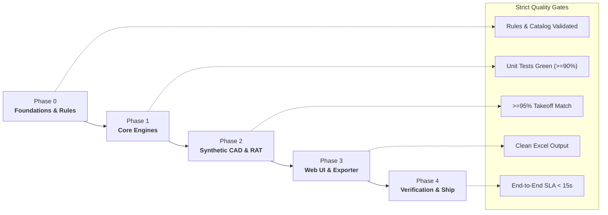

# AutoSpec AI — Project Lifecycle & Phase Gates

## Executive Overview
AutoSpec AI is an AI-powered 2D CAD vector takeoff and pre-construction cost intelligence engine designed for Indian architectural studios, interior designers, and quantity surveyors.

This document defines the formal **Phase Gates**, **Deliverables**, and **Quality Gates** governing the AutoSpec AI lifecycle from initial setup to production readiness, strictly incorporating the **7-Day Concierge Benchmark Plan** defined in Section 6 of the PRD.

---

## Lifecycle Architecture

---

## Phase 0: Foundations, Governance & Catalog
**Objective**: Establish repository rules, contributor guidelines, dependencies, and seed catalog truth.

- [x] Extract PRD and verify requirements.
- [x] Configure agent rules and guidelines (`AGENTS.md`, `.agents/rules/`).
- [ ] Initialize Python virtual environment / dependencies (`requirements.txt`).
- [ ] Construct `catalog.json` with 30–50 verified Indian market SKUs across Civil, Electrical, Plumbing, HVAC, and Finishes with accurate INR pricing and procurement URLs.

**Exit Gate 0**:
- Valid `catalog.json` with schema validation.
- All core dependencies installable cleanly.

---

## Phase 1: Core Mathematical & Parsing Engines
**Objective**: Build the three foundational headless computational modules.

### Module 1: CAD Vector Parser (`cad_parser.py`)
- Read 2D DXF files (ASCII/Binary R12 to 2018) via `ezdxf`.
- In-memory processing: zero external cloud storage of proprietary CAD geometry (Air-gap guarantee).
- Extraction of `INSERT` block counts (lights, fans, switches, plumbing fixtures) with alias matching.
- Extraction of closed `LWPOLYLINE`, `POLYLINE`, and `HATCH` areas.
- Automated detection of drawing scale (`$INSUNITS`) and unit normalization (mm → m / m²).
- Detection and dimensioning of openings (doors, windows, ventilators).

### Module 2: Natural Language Brief Interpreter (`spec_parser.py`)
- Hybrid architecture:
  - **Live Mode**: Anthropic Claude 3.5 Sonnet (`claude-3-5-sonnet-20241022`) with structured JSON schema.
  - **Fallback Mode**: Deterministic heuristic token & regex parser for offline / unkeyed testing.
- Extraction of lighting wattage, CCT (3000K/4000K/6500K), fan motor types (BLDC/Induction), switch grades, tile types, and paint grades.

### Module 3: IS 1200 Statutory Deduction & Price Matching Engine (`boq_engine.py`)
- Statutory Indian Standard calculation logic:
  - **IS 1200 Part 4 (Brickwork / Masonry)**: Openings $\le 0.1 \text{ m}^2$ have zero deduction; $> 0.1 \text{ m}^2$ deduct opening volume ($A \times t$).
  - **IS 1200 Part 12 (Plastering & Pointing)**:
    - $\le 0.5 \text{ m}^2$: Zero deduction, no reveals added.
    - $0.5 < A \le 3.0 \text{ m}^2$: Deduct single face ($1.0 \times A$).
    - $> 3.0 \text{ m}^2$: Deduct both faces ($2.0 \times A$) and add jambs/reveals/sills.
- Automated joining of CAD quantities + Client specs + `catalog.json`.
- Corporate-styled Excel generation (`.xlsx`) via `openpyxl` with dynamic formulas, currency formats, and active hyperlinks.

**Exit Gate 1**:
- Headless pipeline executes and outputs valid BOQ dictionary.
- 100% of IS 1200 deduction boundary cases pass unit tests.

---

## Phase 2: Synthetic CAD Benchmark & RAT (Riskiest Assumption Test)
**Objective**: Validate the #1 Riskiest Assumption: proving `ezdxf` achieves $\ge 95\%$ line-item quantity accuracy on Indian architectural drawings.

### 7-Day Concierge Benchmark Protocol (PRD Section 6 Alignment)
1. **Sample Plan Generator (`sample_dxf_generator.py`)**:
   - Programmatically construct authentic 2D architectural DXF floor plan (`samples/sample_2bhk_plan.dxf`).
   - Include realistic layers (`A-WALL`, `A-DOOR`, `A-GLAZ`, `FLOOR_FINISH`, `E-LITE`, `E-FAN`, `E-SWCH`).
   - Include varied opening sizes to hit all three IS 1200 tiers ($<0.5 \text{ m}^2$, $0.5–3.0 \text{ m}^2$, $>3.0 \text{ m}^2$).
2. **Automated Benchmark Audit (`benchmark_audit.py`)**:
   - Compare automated takeoff output against human-verified ground truth.
   - Assert $\ge 95\%$ line-item quantity accuracy threshold.

**Exit Gate 2**:
- Automated benchmark test passes with $\ge 95\%$ accuracy.

---

## Phase 3: Interactive Web UI & Exporter (`app.py`)
**Objective**: Build a responsive, single-page Streamlit application for end-to-end user workflows.

### Workflow Panels:
1. **Sidebar Controls**: File upload (`.dxf`), "Load Bundled 2BHK Sample" button, unit selector, ceiling height / wall thickness configuration, API key input.
2. **Tab 1: 📐 CAD Takeoff & Inspector**: Visual metric cards (Block Count, Floor Area, Wall Area, Opening Count) and detected entity tables.
3. **Tab 2: 📝 Client Brief & Specs**: Brief input area, sample brief presets, extracted JSON view with manual override toggles.
4. **Tab 3: 📊 IS 1200 Statutory BOQ & Audit**: Interactive filtered table, trade distribution charts, and step-by-step IS 1200 deduction calculation log.
5. **Tab 4: 📥 Export & Procurement**: One-click download for `.xlsx` and `.csv`, plus procurement links.

**Exit Gate 3**:
- Streamlit application launches without warnings.
- End-to-end flow from upload to Excel download operates in under 15 seconds.

---

## Phase 4: Verification, Hardening & Handover
**Objective**: End-to-end regression testing, documentation, and operational readiness.

- [ ] Execute complete `pytest` suite across all modules.
- [ ] Verify Excel output opens cleanly in Microsoft Excel & Google Sheets without repair warnings.
- [ ] Complete `README.md` with installation, CLI execution, and troubleshooting guide.
- [ ] Produce `walkthrough.md` with execution proof and validation outputs.

**Exit Gate 4**:
- All tests passing.
- Complete documentation delivered.
