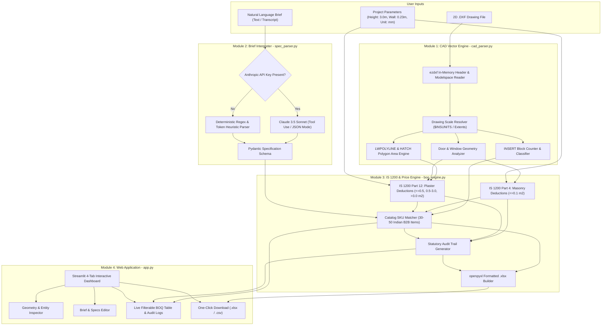

# AutoSpec AI — Product Requirements Document (PRD)
## 2D CAD Vector Takeoff & Pre-Construction Cost Intelligence Engine
**Target Platform:** Antigravity AI IDE / Streamlit Local Workspace  
**Document Version:** 2.0 (Deep Research & Production Architecture Specification)  
**Target Market:** Indian Architectural Studios, Interior Designers, and Quantity Surveyors  
**Core Stack:** Python 3.12+, `ezdxf`, Anthropic Claude 3.5 Sonnet, `openpyxl`, `pandas`, `streamlit`, `pydantic`

---

## 1. Executive Summary & Product Vision

**AutoSpec AI** is an AI-powered pre-construction cost intelligence engine engineered specifically for boutique and mid-market architectural studios, interior design practices, and freelance quantity surveyors in India.

The platform bridges:
1. **Native 2D AutoCAD vector files (`.DXF`)** parsed 100% locally in-memory via `ezdxf` with zero cloud leakage.
2. **Unstructured client conversational briefs** (written notes, email transcripts, voice memos) converted into typed technical specifications via Anthropic Claude 3.5 Sonnet (with a deterministic heuristic fallback).
3. **Bureau of Indian Standards (IS 1200)** statutory measurement and deduction invariants (Part 3/4 Masonry, Part 11 Flooring, Part 12 Plastering).
4. **Live Indian B2B Procurement Catalogs** (Moglix, Industrybuying, Amazon Business, and verified OEM distributors) supplying real-time INR unit rates and direct buy-links.
5. **Standardized Excel BOQ Generation** (`.xlsx`) via `openpyxl` with dynamic formulas, corporate styling, and statutory deduction audit trails.

The core goal of the MVP is to reduce the pre-construction estimation cycle from **3–7 days of manual CAD polyline tracing** to **under 15 seconds**, eliminating the 10–40% "Budget-Aspiration Gap" and budget overruns that plague early-stage Indian residential and interior design projects.

---

## 2. Market Reality & Problem Analysis

### 2.1 The 2D CAD Reality & The "BIM Cost Wall"
In the Indian architecture and interior design market:
- **80% to 85%** of independent studios and mid-sized practices design exclusively in 2D AutoCAD (`.DWG` / `.DXF`).
- **The BIM Barrier:** Autodesk Revit / BIM suites cost between **₹5.07 Lakhs and ₹6.82 Lakhs per seat/year** in licensing and certified workstation hardware. For a boutique studio billing ₹1.5L to ₹4.0L per residential project, a single BIM license absorbs 150% to 270% of gross fees, making BIM adoption economically impossible.

### 2.2 Labor Waste & Human Error in Manual Takeoff
- In residential projects (1,000 to 5,000 sq.ft), studios do not retain dedicated quantity surveyors. Lead architects or junior draftsmen manually execute `PLINE`, `AREA`, `DIST`, and `BCOUNT` commands across dozens of drawing layers.
- This manual process consumes **50% to 80%** of total pre-construction estimation time.
- Human error rates average **$\pm 10\%$ to $15\%$**, stemming from unclosed polylines, double-counted block symbols, and manual Excel formula entry errors.

### 2.3 The "Wish vs. Budget Gap" & Hidden MEP Costs
- During Stage 1 schematic discovery, architects quote rough plinth-area rates (e.g., ₹2,200 to ₹3,500/sq.ft).
- These rough rates account only for basic civil structure and omit:
  - Mechanical, Electrical & Plumbing (MEP) fixtures (modular touch switches, BLDC fans, recessed warm-white downlights, CP fittings).
  - High-end surface finishes (vitrified tiles, Italian marble, luxury emulsions).
- MEP and finishes typically constitute **35% to 55%** of total residential interior expenditure. Omitting them early creates a massive budget disconnect that forces destructive value-engineering and site redesigns mid-construction.

### 2.4 The CPWD DSR Reporting Lag
- Conventional cost estimates rely on the **Central Public Works Department (CPWD) Delhi Schedule of Rates (DSR)**.
- **The Lag Problem:** DSR schedules are updated only every 2 to 3 years. They reflect civil and government construction standards but completely miss spot market surges (e.g., river sand surges of +85% over DSR baselines) and contemporary luxury consumer finishes.
- Private architectural work requires **Live Market Rate Analysis** pegged to current B2B supplier prices.

---

## 3. Competitive Intelligence & Strategic White Space

| Evaluation Dimension | Global SaaS (Togal.AI / Kreo) | Legacy Desktop (PlanSwift / Bluebeam) | Traditional Manual QS (Excel + AutoCAD) | **AutoSpec AI (This Product)** |
| :--- | :--- | :--- | :--- | :--- |
| **Input Format** | Rasterized PDF | PDF / 2D CAD (manual point-and-click) | `.DWG` / `.DXF` / Paper prints | **Native 2D `.DXF` Vector CAD** |
| **Parsing Engine** | Computer Vision / Cloud OCR | Manual clicking & manual assemblies | Manual `PLINE`, `AREA`, `BCOUNT` | **100% In-Memory `ezdxf` Vector Math** |
| **CAD Data Privacy** | ❌ Files uploaded to US/EU cloud | ✅ Local desktop installation | ✅ Local workstation | **✅ 100% Air-Gapped Local In-Memory** |
| **Indian Standards (IS 1200)** | ❌ Zero statutory compliance | ❌ None (must build custom formulas) | ⚠️ Partial (manual calculator) | **✅ Hardcoded IS 1200 Parts 2, 4, 11, 12** |
| **Client Brief Translation** | ❌ None | ❌ None | ⚠️ Manual interpretation | **✅ Hybrid LLM (Claude 3.5 / Heuristics)** |
| **Procurement Integration** | ❌ US/EU vendor databases | ❌ None | ❌ Manual web search | **✅ Verified Indian B2B SKUs (Moglix, Amazon.in)** |
| **Pricing Model** | $100–$300 / user / month (USD) | $1,749+ upfront perpetual / renewal | Billable hours (₹25,000–₹60,000/mo) | **Open-core Python / Lightweight Web UI** |

---

## 4. User Personas & Core Workflows

### Persona A: Lead Architect / Studio Principal (Boutique Practice)
- **Profile:** Runs a 4-person design studio in Bangalore/Mumbai doing 8–12 luxury residential interiors annually.
- **Pain Point:** Spends late nights auditing junior draftsmen's manual BOQs; loses clients when early estimates deviate by 25% from final contractor bids.
- **Needs:** Fast turnaround (<15 minutes) during Stage 1 discovery; reliable cost estimates anchored in real Indian market brands (Havells, Philips, Atomberg, Schneider, Kajaria).

### Persona B: Interior Designer & Turnkey Contractor
- **Profile:** Executes turnkey residential interior fit-outs in Delhi NCR/Pune.
- **Pain Point:** Client says "I want warm minimalist lighting and smart BLDC fans." Translating that into exact billable line items and procurement orders takes days of catalog searching.
- **Needs:** Automated conversion of conversational client briefs into priced SKUs with direct "Buy Now" links for fast procurement.

### Persona C: Quantity Surveyor / Cost Consultant
- **Profile:** Freelance cost estimator preparing tender documents for residential and commercial builders.
- **Pain Point:** Contractual disputes with contractors over opening deductions in brickwork and wall plastering.
- **Needs:** Legally compliant **IS 1200 Part 4 & 12** statutory deduction logs with clear audit notes for every door and window opening.

---

## 5. Technical System Architecture



---

## 6. Functional Module Specifications

### 6.1 Module 1: CAD Ingestion & Vector Extraction (`cad_parser.py`)
- **Library:** `ezdxf` (pure in-memory parsing).
- **Supported Formats:** AutoCAD DXF R12 through 2018 (ASCII and Binary).
- **Zero-Cloud Guarantee:** Files are read from memory/local path; raw geometry is never transmitted across the network.
- **Unit Scale Detection:**
  1. Inspect `$INSUNITS` in DXF header (`4` = mm, `6` = m, `1` = inches).
  2. If undefined (`0`), inspect modelspace bounding box extents. Extents $> 500$ infer millimeters; extents $< 100$ infer meters.
  3. Default to millimeters ($\text{scale factor } 0.001$, $\text{area factor } 10^{-6}$).
- **Entity Extraction Logic:**
  - **`INSERT` Entities (Blocks):**
    - Query modelspace blocks: `msp.query("INSERT")`.
    - Group by block name and map via regex/fuzzy aliases to trades:
      - `LIGHT_*`, `DOWNLIGHT`, `DL_*`, `COVE_*` $\rightarrow$ Electrical: Lighting.
      - `FAN_*`, `CEILING_FAN`, `CFAN_*` $\rightarrow$ Electrical: Fans.
      - `SWITCH_*`, `SW_*`, `MODULAR_*`, `SOCKET_*` $\rightarrow$ Electrical: Switches & Sockets.
      - `WC_*`, `EWC`, `WASH_BASIN`, `BASIN`, `SINK` $\rightarrow$ Plumbing / Sanitary.
  - **`LWPOLYLINE` & `POLYLINE` Entities (Room Boundaries):**
    - Filter closed polylines on layers matching `WALL`, `A-WALL`, `FLOOR`, `A-FLOR`, `CEILING`, `A-CLNG`.
    - Calculate polygon area using the shoelace algorithm via `ezdxf.math.area()`.
  - **`HATCH` Entities (Patterned Surfaces):**
    - Extract boundary paths via `ezdxf.path.from_hatch()`.
    - Calculate planar surface areas using path polygon flattening.
  - **Opening Extraction:**
    - Detect door/window blocks (e.g. `DOOR_*`, `WINDOW_*`, `WIN_*`, `D1`, `D2`, `W1`) and opening cutouts on layers `A-DOOR`, `A-GLAZ`, `DOOR`, `WINDOW`.
    - Calculate opening widths and associate standard Indian architectural vertical heights (Doors: 2.1m, Windows: 1.2m, Ventilators: 0.6m) to compute vertical opening areas in $\text{m}^2$.

### 6.2 Module 2: Natural Language Brief Interpreter (`spec_parser.py`)
- **Engine:** Anthropic Claude 3.5 Sonnet (`claude-3-5-sonnet-20241022`) via official `anthropic` Python SDK.
- **Fallback Engine:** Deterministic regex & token frequency extractor ensuring 100% testability offline or without an active API key.
- **Pydantic Schema Output:**
  ```python
  class ClientSpecification(BaseModel):
      project_type: str = "Residential"
      preferred_lighting_brand: Literal["Philips", "Havells", "Wipro", "Syska", "Any"] = "Philips"
      lighting_wattage: int = Field(default=12, description="Wattage in Watts (e.g. 12, 15)")
      lighting_color_temp: Literal["3000K", "4000K", "6500K"] = "3000K"
      preferred_fan_brand: Literal["Atomberg", "Havells", "Crompton", "Orient", "Any"] = "Atomberg"
      fan_type: Literal["BLDC", "Induction"] = "BLDC"
      preferred_switch_brand: Literal["Schneider", "Legrand", "Havells", "Anchor", "Any"] = "Schneider"
      switch_grade: Literal["Modular", "Smart"] = "Modular"
      flooring_preference: Literal["Vitrified Tile", "Italian Marble", "Granite", "Ceramic"] = "Vitrified Tile"
      paint_preference: Literal["Luxury Emulsion", "Premium Emulsion", "Tractor Emulsion"] = "Luxury Emulsion"
      sanitaryware_brand: Literal["Jaquar", "Kohler", "Hindware", "Any"] = "Jaquar"
  ```

### 6.3 Module 3: Statutory IS 1200 Calculation & Price Matcher (`boq_engine.py`)
- **Bureau of Indian Standards Statutory Rules:**
  - **IS 1200 Part 3 & 4 (Brickwork & Masonry):**
    - For each opening with area $A_{\text{op}}$:
      $$\text{Deduction Area} = \begin{cases} 0.0 & \text{if } A_{\text{op}} \le 0.1 \text{ m}^2 \\ A_{\text{op}} & \text{if } A_{\text{op}} > 0.1 \text{ m}^2 \end{cases}$$
    - Masonry Volume Deduction: $V_{\text{deduct}} = \text{Deduction Area} \times t_{\text{wall}}$ (where $t_{\text{wall}} = 0.23 \text{ m}$ by default).
  - **IS 1200 Part 12 (Plastering & Pointing):**
    - Both internal and external faces of walls are plastered (Gross Plaster Area = $\text{Gross Wall Area} \times 2$).
    - Deductions for each opening are classified into three statutory tiers:
      $$\text{Plaster Deduction} = \begin{cases} 0.0 & \text{if } A_{\text{op}} \le 0.5 \text{ m}^2 \text{ (Zero deduction, no reveals added)} \\ 1.0 \times A_{\text{op}} & \text{if } 0.5 < A_{\text{op}} \le 3.0 \text{ m}^2 \text{ (Deduct single face only)} \\ 2.0 \times A_{\text{op}} - \text{Reveal Addition} & \text{if } A_{\text{op}} > 3.0 \text{ m}^2 \text{ (Deduct both faces, add reveals)} \end{cases}$$
  - **IS 1200 Part 11 (Flooring & Ceilings):**
    - Measured net in plan area ($\text{m}^2$). No deductions for columns/openings $\le 0.1 \text{ m}^2$.
- **Catalog Price Matcher (`catalog.json`):**
  - Contains 30–50 verified Indian B2B SKUs across 5 trades:
    - Civil & Masonry (Red bricks, UltraTech cement, M-Sand)
    - Finishes (Kajaria vitrified tiles, Asian Paints Royale Luxury Emulsion, false ceiling gypsum)
    - Electrical (Philips/Havells 12W/15W 3000K/6500K spots, Atomberg Renesa 1200mm BLDC, Schneider Opale 6A/16A switches, Polycab FR wires)
    - Plumbing (Jaquar basin mixers, Kohler wall-hung EWC, Hindware wash basins)
    - HVAC (Exhaust fans, AC copper piping)
- **Excel Spreadsheet Exporter (`openpyxl`):**
  - Generates `.xlsx` files with professional corporate palette (Header: `#1F4E79`, Text: `#FFFFFF`).
  - Strict numeric types for quantities and rates (never strings).
  - Excel formulas for total calculations (`=D{row}*F{row}`) and trade subtotals (`=SUM(G{start}:G{end})`).
  - Active clickable hyperlinks (`Buy Now` pointing to verified procurement URLs).
  - Explicit column widths auto-calculated to prevent truncated text or `###` display errors.

### 6.4 Module 4: Web Application (`app.py`)
- **Framework:** `streamlit` single-page responsive interface.
- **Header:** Project branding, tagline, and real-time backend status badge (Claude 3.5 Sonnet / Heuristic Mode).
- **Sidebar:**
  - File uploader (`.DXF` format).
  - "Load Bundled 2BHK Architectural Plan" one-click button.
  - Geometry settings: Drawing Units (`mm` / `m`), Ceiling Height (`3.0 m`), Wall Thickness (`0.23 m`).
  - Anthropic API Key input field (masked).
- **Tabs:**
  - **Tab 1: 📐 CAD Takeoff & Vector Inspector:** Metric cards for block counts, net floor area, gross wall area, and opening count. Data table of all detected entities.
  - **Tab 2: 📝 Client Brief & Specifications:** Text area for natural language brief; preset sample brief buttons; editable JSON specification viewer.
  - **Tab 3: 📊 IS 1200 Statutory BOQ & Audit:** Filterable and sortable BOQ table; trade cost distribution charts; expandable **IS 1200 Audit Trail** detailing step-by-step statutory deduction math.
  - **Tab 4: 📥 Export & Procurement:** Download `.xlsx` button; Download `.csv` button; direct procurement table with active links.

---

## 7. Data Models & Schemas

### 7.1 Catalog Database Schema (`catalog.json`)
```json
{
  "sku_id": "LGT-PHL-12W-3K",
  "trade": "Electrical",
  "sub_category": "Downlight",
  "brand": "Philips",
  "model_name": "Stellar Recessed LED",
  "specifications": {
    "wattage": 12,
    "color_temp": "3000K",
    "cutout_mm": 120,
    "cri": ">80"
  },
  "unit": "Pcs",
  "unit_rate_inr": 420.0,
  "hsn_code": "9405",
  "gst_percent": 18,
  "vendor": "Amazon Business India",
  "buy_url": "https://www.amazon.in/dp/B08C1X9K8Z"
}
```

### 7.2 BOQ Line Item Schema
```json
{
  "item_no": "ELE-001",
  "trade": "Electrical",
  "description": "Supply and installation of Philips Stellar 12W 3000K Warm White Recessed LED Downlight including driver and connection",
  "cad_source": "Block: LIGHT_DOWNLIGHT (18 instances)",
  "quantity": 18.0,
  "unit": "Pcs",
  "unit_rate_inr": 420.0,
  "total_cost_inr": 7560.0,
  "procurement_url": "https://www.amazon.in/dp/B08C1X9K8Z",
  "audit_note": "18 blocks detected across LIVING, BED1, BED2, KITCHEN"
}
```

### 7.3 IS 1200 Deduction Audit Schema
```json
{
  "trade": "Civil - Plastering",
  "gross_wall_area_sqm": 195.4,
  "both_faces_area_sqm": 390.8,
  "openings_analyzed": [
    {
      "id": "D1",
      "type": "Door",
      "dimensions": "1.0m x 2.1m",
      "area_sqm": 2.1,
      "statutory_tier": "Tier 2 (0.5m2 to 3.0m2)",
      "statutory_rule": "IS 1200 Part 12 Clause 4.3.1 (Deduct single face)",
      "deduction_sqm": 2.1
    },
    {
      "id": "W1",
      "type": "Window",
      "dimensions": "1.5m x 1.2m",
      "area_sqm": 1.8,
      "statutory_tier": "Tier 2 (0.5m2 to 3.0m2)",
      "statutory_rule": "IS 1200 Part 12 Clause 4.3.1 (Deduct single face)",
      "deduction_sqm": 1.8
    },
    {
      "id": "V1",
      "type": "Ventilator",
      "dimensions": "0.5m x 0.5m",
      "area_sqm": 0.25,
      "statutory_tier": "Tier 1 (<= 0.5m2)",
      "statutory_rule": "IS 1200 Part 12 Clause 4.3.1 (Zero deduction)",
      "deduction_sqm": 0.0
    }
  ],
  "total_deduction_sqm": 3.9,
  "net_plaster_area_sqm": 386.9
}
```

---

## 8. Non-Functional & Reliability Requirements

1. **Air-Gap Privacy Guarantee:**  
   Proprietary CAD files (`.DXF`, `.DWG`) are never uploaded to any remote server or external LLM. Only processed text tokens (summarized line item counts) are communicated externally if the LLM mode is active.
2. **Performance SLA:**  
   Processing a standard residential 2D DXF plan (<5MB, up to 500 blocks and 5,000 polyline vertices) must complete in **under 15 seconds** on a standard local workstation.
3. **Spreadsheet Engine Compliance:**  
   Exported `.xlsx` workbooks must open cleanly in Microsoft Excel (Windows/Mac), Google Sheets, and LibreOffice Calc without corruption warnings or repair prompts.
4. **Zero-Crash Resilience:**  
   Malformed DXF entities, unclosed polylines, or unkeyed network states must trigger graceful visual warnings rather than unhandled Python exceptions.

---

## 9. The 7-Day Concierge Benchmark (RAT Plan)

To validate the **#1 Riskiest Assumption Test (RAT)** — that the `ezdxf` parsing engine can achieve **$\ge 95\%$ line-item quantity accuracy** against real-world Indian CAD files without manual layer pre-cleaning — the following protocol is hardcoded into the project lifecycle:

- **Days 1–3 (Dataset Acquisition):** Ingest 10 real-world residential CAD drawings alongside their human-verified contractor BOQs.
- **Days 4–6 (Automated Takeoff Execution):** Execute headless automated takeoff via `benchmark_audit.py`.
- **Day 7 (Statistical Accuracy Audit):** Compare automated quantity takeoffs against ground-truth manual sheets.
  - **Pass Criteria:** At least 8 of the 10 drawings achieve $\ge 95\%$ quantity takeoff match across all primary trades.

---

## 10. Implementation Roadmap & Milestones

- **Phase 0: Foundations & Data Setup:** Dependencies, Seed B2B Catalog (`catalog.json` with 40+ SKUs), Project Rules.
- **Phase 1: Core Headless Engines:** `cad_parser.py`, `spec_parser.py`, `boq_engine.py` with 100% test pass on IS 1200 edge cases.
- **Phase 2: Synthetic CAD Plan & RAT Runner:** `sample_dxf_generator.py` and `benchmark_audit.py`.
- **Phase 3: Interactive Streamlit UI:** Complete 4-tab workflow with Excel export.
- **Phase 4: Full Verification & Final Handover:** Regression testing, user documentation, and operational sign-off.